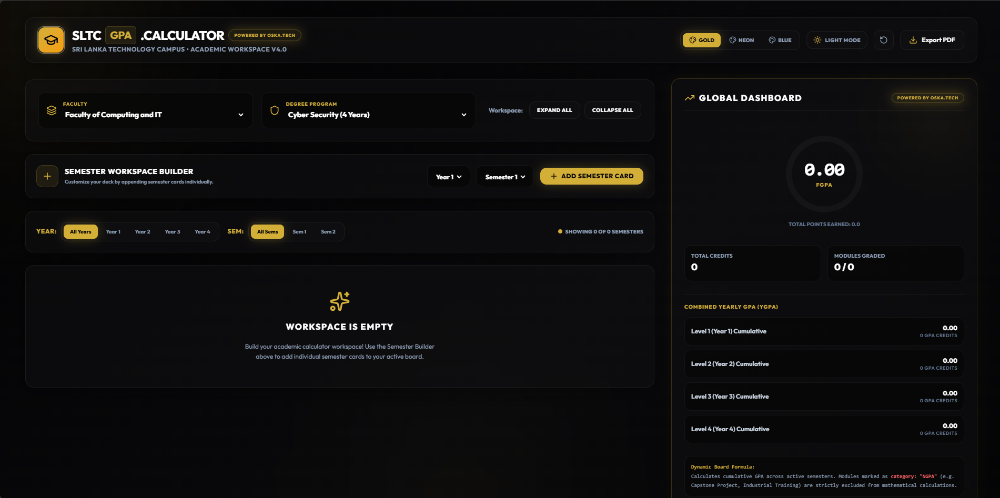

<div align="center">

  

  <br />
  <br />

  # 🎓 SLTC GPA CALCULATOR : THE ACADEMIC WORKSPACE
  
  ***"Non scholae sed vitae discimus"***

  <p align="center">
    A next-generation, zero-data-entry GPA tracking engine designed exclusively for the Faculty of Computing and IT at Sri Lanka Technology Campus (SLTC).
  </p>

  <p align="center">
    
    
    
    
  </p>

  <b>POWERED BY OSKA.TECH</b>
</div>

---

## 📑 Table of Contents
- [About the Project](#-about-the-project)
- [Next-Level Features](#-next-level-features)
- [Supported Curriculums](#-supported-curriculums)
- [Tech Stack & Architecture](#-tech-stack--architecture)
- [Getting Started](#-getting-started)
- [Contributing](#-contributing)

---

## 🚀 About the Project

Most GPA calculators require students to manually type out module names, credit values, and search for their grades. The **SLTC GPA Calculator** revolutionizes this process. 

By hardcoding the official **May 2024 SLTC Curriculum**, this app acts as a complete "Academic Workspace." Students simply select their Degree and Semester, and the app instantly builds out their exact module dashboard. From there, it calculates the Semester GPA (SGPA), Yearly Cumulative GPA (YGPA), and the Final GPA (FGPA) in real-time.

## ✨ Next-Level Features

* **🧠 Smart Curriculum Engine:** Auto-populates Core modules and handles Elective pools accurately based on the specific degree and year.
* **⚡ Real-Time Analytics:** The "Global Dashboard" recalculates your FGPA, YGPA, Total Credits, and Points instantly as you select a grade.
* **🧮 NGPA Awareness Logic:** Built-in intelligence to detect Non-GPA modules (e.g., Industrial Training) and strictly exclude them from the mathematical divisor, ensuring 100% accurate results.
* **🎨 Premium Glassmorphism UI:** A sleek, modern, translucent design system featuring dynamic moving gradients, hover micro-interactions, and multiple theme accents (Gold, Neon, Blue).
* **🗂️ Multi-Semester Workspace:** Expand all 8 semesters (4 years) on a single screen to map out your entire degree journey at a glance.
* **📄 One-Click Export:** Download a beautifully formatted PDF of your full academic result sheet.

## 📚 Supported Curriculums

This workspace is fully calibrated for the **Faculty of Computing and IT** (Based on the updated May 2024 syllabus):

* `[ BSc Hons ]` Software Engineering
* `[ BSc Hons ]` Cyber Security
* `[ BSc Hons ]` Cloud Computing
* `[ BSc Hons ]` Data Science
* `[ Degree ]` Applied Information Technology (3-Year)

*(Note: Other faculties like Engineering and Business are intentionally disabled in the UI to maintain strict accuracy with IT faculty rules).*

## 🛠️ Tech Stack & Architecture

* **Frontend Framework:** React.js (Hooks, Context API for global state management)
* **Styling Engine:** Tailwind CSS
* **Animations:** Framer Motion (Smooth layout transitions and number counting algorithms)
* **Icons:** Lucide React
* **Data Structure:** Highly scalable JSON architecture separating Core modules and Elective pools.

## 💻 Getting Started

To run this project locally and explore the workspace:

### Prerequisites
Make sure you have Node.js and npm installed.

### Installation

1. Clone the repository:
   ```bash
   git clone [https://github.com/yourusername/sltc-gpa-calculator.git](https://github.com/yourusername/sltc-gpa-calculator.git)
